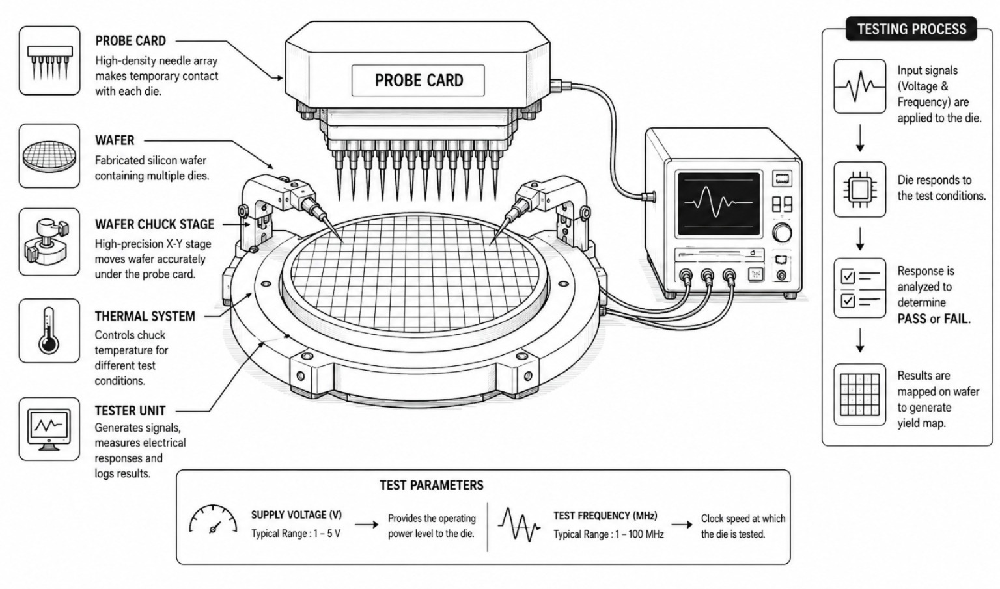

## Theory

### Introduction

Electrical Die Sorting (EDS), also known as wafer probing or circuit probing, is the final testing stage before a completed semiconductor wafer is cut into individual chips. Even in advanced cleanrooms, subtle chemical imbalances, temperature shifts, or microscopic dust particles can cause specific areas on a wafer to fail. To prevent spending money on packaging non-functional silicon, every single chip on the wafer must be verified for performance.

This process uses a hardware testing grid to feed controlled voltages and speed frequencies into each chip. It allows engineers to isolate working components, group them by speed, and diagnose tool calibration errors across the manufacturing line.

### Principle of Electrical Die Sorting

The testing sequence uses an automated, ultra-precision stage that maneuvers the fabricated wafer beneath a high-density electronic testing card. 

Microscopic, spring-loaded needle pins press down onto the metal landing pads of an individual chip to create a temporary electrical highway. The machine then runs specialized functional tests by supplying an operating voltage and a clock speed frequency. If the chip completes its logic loops within expected microsecond constraints, it passes; if it lags behind, draws wrong current levels, or fails to respond, it is filtered out. 

Because the system logs the exact position of every passing and failing chip, it creates a visual yield map across the circular topography of the wafer substrate.

### Major Components of a Wafer Probe Station

An industrial electrical testing station consists of several major components:

* **Probe Card:** A specialized interface board holding thousands of microscopic needle contacts that touch the chip.
* **Parametric Tester Unit:** The computer driver system that generates input signals and analyzes returning data strings.
* **Automated Wafer Chuck Stage:** A robotic platform that shifts the wafer in precise micrometric X-Y matrix patterns.
* **Thermal Management System:** Controls the chuck base temperature to test chip performance under extreme heat or cold.
* **Inking Assembly:** Historically drops a physical ink dot on failed chips (modern systems use a software database map instead).
* **Yield Telemetry Dashboard:** Digital counter readouts displaying real-time pass, fail, and percentage analytics.

### Common Test Bins & Categories

During checking, functional chips are sorted into performance and quality buckets, known as "bins."

| Sorting Bin | Visual Status Code | Engineering Definition / Action |
| :--- | :--- | :--- |
| **Pass Bin 1 (Premium)** | Green Block | Perfect performance; certified for high-frequency operation. |
| **Pass Bin 2 (Standard)** | Blue / Light Green Block | Fully functional, but operates safely only at lower clock frequencies. |
| **Fail Bin 1 (Functional)** | Red Block | Logic path error or timing lag; marked for rejection. |
| **Fail Bin 2 (Parametric)**| Orange / Dark Red Block | Severe electrical short or dead gate oxide layer; structural failure. |

### Process Parameters

The rigor and stress-testing thresholds of the die sort sequence are primarily controlled by two important parameters.

#### 1. Supply Voltage (V)

Supply voltage sets the baseline input power level used to charge internal transistor capacitors.

* Under-Voltage &rarr; Insufficient electrical drive (causes logic circuits to lag and fail timing deadlines)
* Over-Voltage &rarr; Excessive power stress (can rupture fragile gate insulation and cause electrical shorts)

Typical operating range:
**1–5 V**

#### 2. Test Frequency (MHz)

Test frequency sets the clock speed (cycles per second) at which the chip is forced to perform computations.

* Lower Frequency &rarr; Easier execution window (allows marginally slow chips to complete cycles and pass)
* Higher Frequency &rarr; Strict execution window (stress-tests limits, separating premium chips from standard ones)

Typical operating range:
**1–100 MHz**

### Testing Profiles & Yield Bottlenecks

As the clock speed frequency increases, the time window for an internal circuit to complete a task shrinks. The performance curve depends heavily on the driving power, modeled by the timing equation:

    Propagation Delay &prop; (<i>C</i> &middot; <i>V</i>) / Drive Current

 

If you push the **Test Frequency** slider up without providing adequate **Supply Voltage**, the transistors cannot switch fast enough to keep up with the clock. This creates timing bottlenecks that cause rows of chips to turn **Red (Fail)**. 

Conversely, raising the voltage allows for higher frequencies, but pushing voltage past extreme hardware boundaries causes permanent breakdown. This drops the **Yield Percentage**, which measures the ratio of passing parts to total fabricated components:

    Yield = (Total Passing Dies / Total Fabricated Dies) &times; 100%

### Advantages of Electrical Die Sorting

Wafer-level sorting provides several process and business advantages over raw visual inspection:

* Avoids high assembly and materials costs by ensuring only good silicon is packaged.
* Enables "Speed Binning," which groups chips by maximum frequency so they can be sold at matching price points.
* Delivers real-time data on wafer error patterns, highlighting specific machine faults across the fab line.
* Minimizes consumer failure risks by stress-testing components under high-voltage configurations.

### Applications

Electrical die sorting processes are mandatory across manufacturing workflows for:

* Stress-testing high-performance computer processors (CPUs and GPUs) for stable overclocking baselines.
* Disabling bad rows or activating spare backup memory cells inside DRAM and Flash storage blocks.
* Qualifying mission-critical automotive chips to ensure flawless performance under voltage drops.
* Gathering yield statistic trends to optimize chemical and lithography steps in future production lots.

### Expected Experimental Outcome

In this virtual experiment, the user investigates the influence of **supply voltage** and **test frequency** on wafer test outcomes. By varying these process parameters, the user can observe changes in:

* Total Pass and Fail Die Counts
* Spatial Defect Distribution Patterns on the Wafer Grid
* Net Wafer Yield Percentage
* Maximum Frequency Operational Bounds (Speed Tiers)
* Overall Wafer Quality Grade

This simulation demonstrates how balancing voltage and frequency settings allows test engineers to screen out defects, map factory faults, and calculate the economic yield of a semiconductor manufacturing batch.