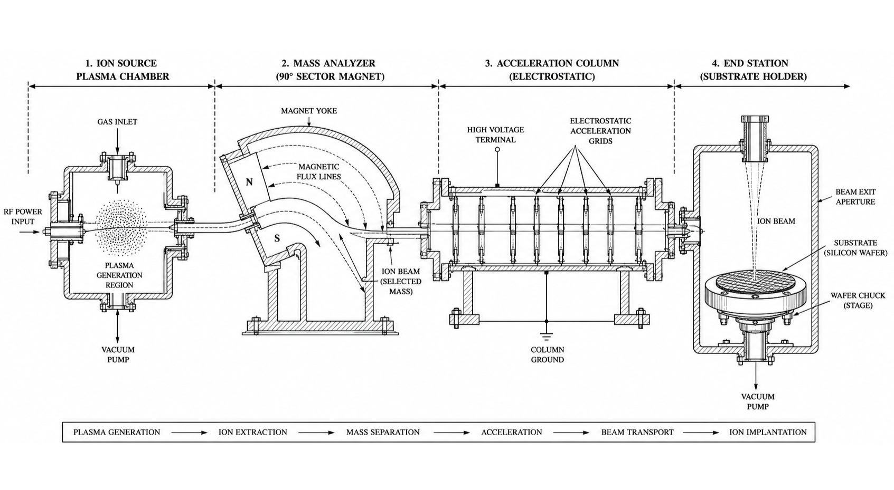

## Theory

### Introduction

Ion implantation is one of the most important doping techniques used in modern semiconductor manufacturing. It is a highly controlled process for introducing impurity atoms, known as **dopants**, into a silicon wafer to modify its electrical properties. Unlike thermal diffusion, where dopant atoms move into the silicon through high-temperature diffusion, ion implantation accelerates dopant ions using electric fields and implants them directly into the wafer with high precision.

The process enables semiconductor manufacturers to accurately control the concentration and depth of dopants, making it an essential technique for fabricating integrated circuits (ICs), microprocessors, memory devices, CMOS transistors, sensors, and power electronic devices.

### Principle of Ion Implantation

In ion implantation, atoms of the desired dopant are first ionized inside an **ion source**, producing positively charged ions. These ions are then accelerated to high kinetic energies using an **acceleration column** operating at high voltage. A **magnetic mass analyzer** separates ions according to their mass-to-charge ratio so that only the required dopant species reaches the wafer.

The accelerated ions travel through a high-vacuum chamber and strike the silicon wafer at high speeds. As the ions enter the silicon crystal, they gradually lose energy due to collisions with silicon atoms until they come to rest beneath the surface. The final depth at which the ions stop depends mainly on the implantation energy.

Because the ions are implanted beneath the wafer surface, the process creates well-defined doped regions with excellent reproducibility and dimensional accuracy.

### Major Components of an Ion Implanter

An ion implantation system consists of several major components:

* **Ion Source:** Generates positively charged dopant ions.
* **Magnetic Mass Analyzer:** Selects the required ion species and removes unwanted ions.
* **Acceleration Column:** Accelerates ions to the desired implantation energy.
* **Beam Scanning System:** Sweeps the ion beam across the wafer to ensure uniform implantation.
* **Vacuum Chamber:** Prevents ion collisions with air molecules and maintains beam stability.
* **Wafer Stage (Chuck):** Holds the silicon wafer securely during implantation.

### Common Dopant Materials

Different dopants are selected depending on the electrical characteristics required in the semiconductor device.

| Dopant             | Semiconductor Type | Typical Application                         |
| ------------------ | ------------------ | ------------------------------------------- |
| **Boron (B)**      | P-type             | PMOS transistors, P-type wells              |
| **Phosphorus (P)** | N-type             | NMOS transistors, Source/Drain regions      |
| **Arsenic (As)**   | N-type             | Shallow junctions, High-performance devices |

### Process Parameters

The quality of ion implantation is primarily controlled by three important parameters.

#### 1. Implantation Energy (keV)

Implantation energy determines how deeply ions penetrate into the silicon wafer.

* Low Energy → Shallow junctions
* High Energy → Deep junctions

Typical operating range:

**20–200 keV**

#### 2. Ion Dose (ions/cm²)

Ion dose represents the total number of dopant ions implanted per unit area.

* Low Dose → Low dopant concentration
* High Dose → High dopant concentration

Typical operating range:

**1 × 10¹³ to 1 × 10¹⁶ ions/cm²**

#### 3. Implantation Time

The implantation time determines the duration for which ions bombard the wafer. Longer implantation times generally increase the total implanted dose.

Typical operating range:

**10–60 seconds**

### Implantation Profile

As energetic ions enter the silicon wafer, they lose kinetic energy through collisions with silicon atoms. The implanted ions eventually stop at an average depth known as the **Projected Range (Rp)**.

The projected range increases with implantation energy and is approximately proportional to the square root of the ion energy:

**Projected Range (Rp) ∝ √(Implantation Energy)**

This relationship enables precise control over junction depth during device fabrication.

### Annealing After Implantation

Ion implantation introduces lattice damage because energetic ions displace silicon atoms from their normal crystal positions. Therefore, the implanted wafer undergoes an **annealing process** after implantation.

Annealing serves two important purposes:

* Repairs damage to the silicon crystal lattice.
* Electrically activates the implanted dopant atoms by allowing them to occupy proper lattice sites.

Without annealing, many implanted dopants remain electrically inactive.

### Advantages of Ion Implantation

Ion implantation offers several advantages over conventional diffusion techniques:

* Extremely accurate control of dopant concentration.
* Excellent control over junction depth.
* Uniform dopant distribution across the wafer.
* Low-temperature doping process.
* Ability to create very shallow junctions required in modern integrated circuits.
* High repeatability and excellent process control.
* Compatible with advanced VLSI and CMOS fabrication technologies.

### Applications

Ion implantation is widely used throughout semiconductor manufacturing for:

* Formation of Source and Drain regions in MOSFETs.
* Well formation in CMOS technology.
* Threshold voltage adjustment.
* Channel engineering.
* Isolation structures.
* Power semiconductor devices.
* Integrated circuits and microprocessors.
* MEMS and sensor fabrication.

### Expected Experimental Outcome

In this virtual experiment, the user investigates the influence of **dopant type**, **implantation energy**, **ion dose**, and **implantation time** on semiconductor doping characteristics. By varying these process parameters, the user can observe changes in:

* Projected Junction Depth
* Dopant Concentration
* Implant Uniformity
* Sheet Resistance
* Overall Device Quality

This simulation demonstrates how precise control of ion implantation parameters enables the fabrication of high-performance semiconductor devices with accurately engineered electrical properties.
