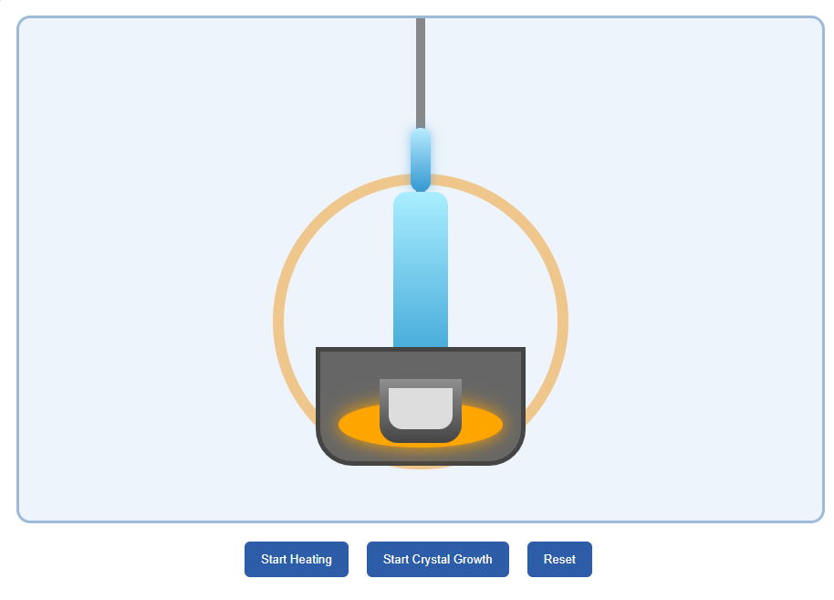

### Procedure
1. Drag the crucible from the equipment tray and place it inside the furnace chamber.

2. Drag the silicon chunks into the crucible.

3. Observe the pull rod and the seed crystal attached to the system.

4. Set the process parameters using the sliders within the allowed operating ranges:

   * Pull Rate: **0.5 – 3 mm/min**
   * Rotation Speed: **5 – 25 RPM**
   * Temperature: **1415 – 1500 °C**

5. For stable crystal growth, maintain approximately:

   * Pull Rate: **1 – 2 mm/min**
   * Rotation Speed: **12 – 20 RPM**
   * Temperature: **1420 – 1470 °C**

6. Click the **Start Heating** button to heat the silicon material.

7. Observe the formation of molten silicon inside the crucible.

8. After melting is completed, click the **Start Crystal Growth** button to begin the crystal pulling process.

9. Observe the crystal growth carefully and monitor:

   * Crystal thickness
   * Growth stability
   * Crystal quality percentage
   * Defect indications

10. Change the parameter values and repeat the experiment to study their effect on crystal quality.

### Setup

### Observations

1. Excessively high pull rate produces thin crystals and increases defect formation.

2. Excessively high temperature causes thermal instability and non-uniform crystal growth.

3. Low rotation speed produces uneven crystal formation due to improper heat distribution.

4. Balanced process conditions produce uniform crystal growth with minimal defects.

5. Crystal quality decreases when unfavorable process parameters are selected.

### Result

The Czochralski crystal growth process was successfully simulated, and the influence of pull rate, temperature, and rotation speed on silicon crystal quality was analyzed.
