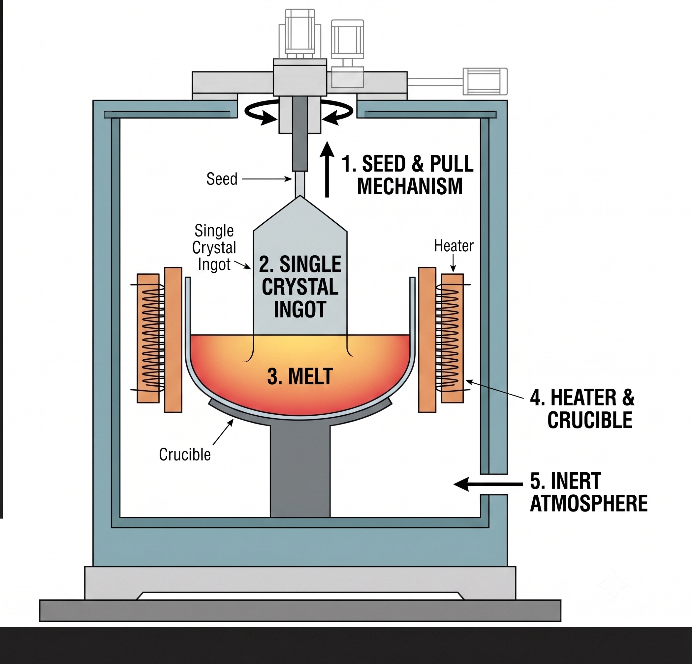

### 
The manufacturing of semiconductor chips begins with the production of a high-purity silicon wafer. A wafer is a thin circular slice of silicon that serves as the foundation on which electronic circuits are built.

One of the most widely used methods for producing silicon wafers is the Czochralski (CZ) Crystal Growth Process. In this process, a single crystal of silicon is grown from molten silicon and later sliced into wafers.

# Czochralski Crystal Growth Process

### Step 1: Melting Silicon
High-purity silicon is heated above its melting point (about 1414°C) inside a crucible, forming molten silicon.

### Step 2: Introducing the Seed Crystal
A small silicon seed crystal is brought into contact with the molten silicon. This seed acts as the starting point for crystal growth.

### Step 3: Crystal Pulling
The seed crystal is slowly pulled upward while rotating. As it moves upward, silicon atoms solidify around it, forming a large cylindrical crystal called an ingot.

### Step 4: Diameter Control
The diameter and quality of the ingot depend on parameters such as pull rate, rotation speed, and temperature. Improper settings can lead to defects or unstable crystal growth.

### Step 5: Wafer Preparation
Once the crystal has grown to the required size, the ingot is sliced into thin wafers, polished, and prepared for semiconductor fabrication.